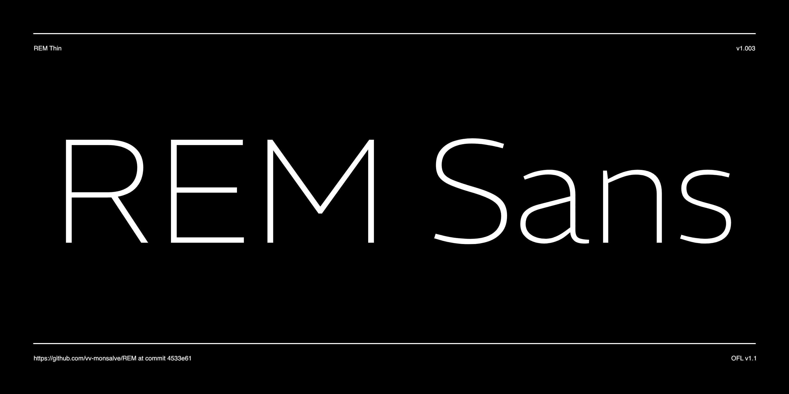

# REM

The REM project is a sans serif font ready for corporate and display uses. It features a heavy low contrast combined with outstrokes that get slightly thinner, which is the opposite of the conventional approach. All together gives it a contemporary feeling suitable for modern branding. With more than 960 glyphs the font is ready for complex type setting with 4 sets of figures, small caps and some alternate glyphs. The font's default settings display a two-story 'a' and a one-story 'g.' Nevertheless, the user can opt to substitute the 'a' with a one-storey version found in the stylistic set 1, replace the 'g' with a two-storey version in the stylistic set 2, or utilize a two-storey 'a' that lacks an outstroke in the stylistic set 3.




## Building the Fonts

The font is built using fontmake and gftools post processing script. Tools are all python based, so it must be previously installed.

To install all the Python tools into a virtualenv, do the following:

From terminal:

```
cd your/local/project/directory
```

Once in the project folder create a virtual environment. 
This step has to be done just once, the first time:

```
python3 -m venv venv
```

Activate the virtual environment. This step should be done every time when working in the project.

```
source venv/bin/activate
```
Install the required dependencies

```
pip install -r requirements.txt

```

Then run the this commands:

```
cd sources
gftools builder config.yml
```

## License

This Font Software is licensed under the SIL Open Font License, Version 1.1.
This license is available with a FAQ at
https://scripts.sil.org/OFL